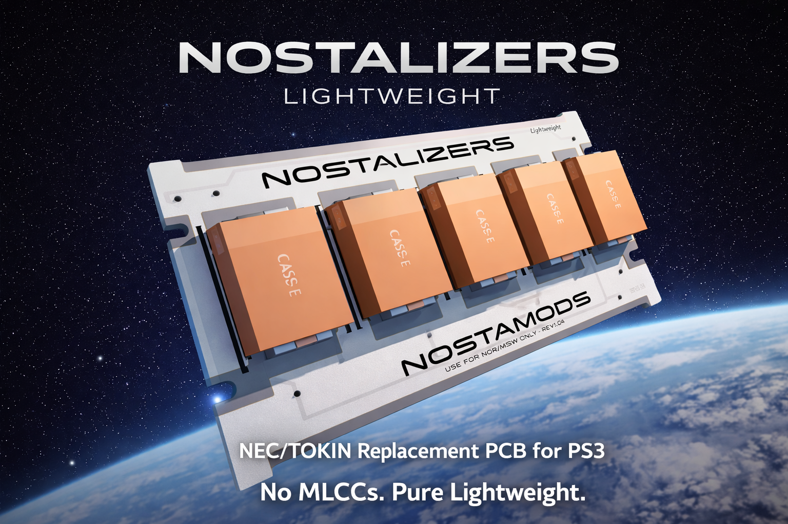
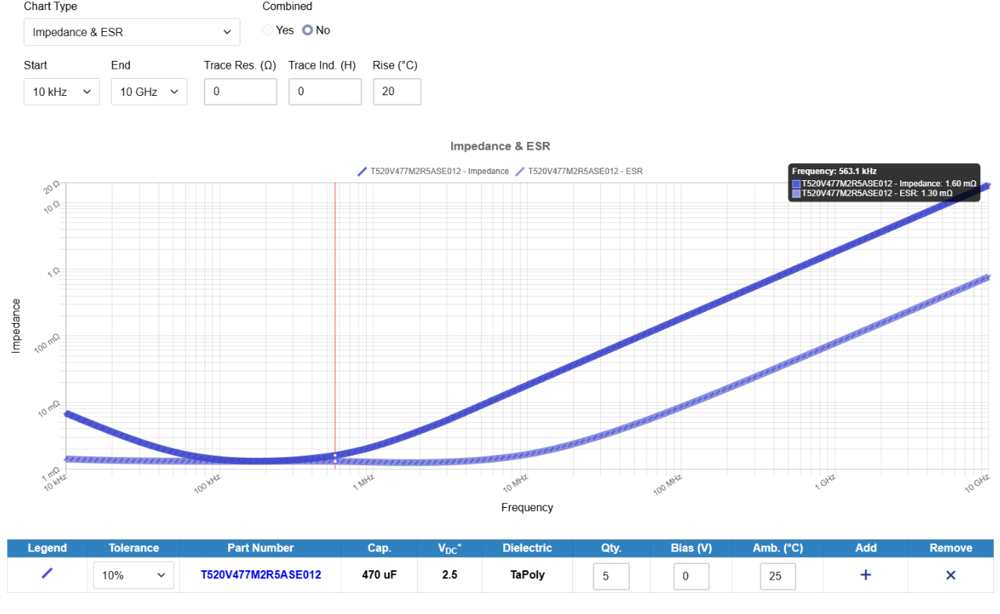

# NostaLizer Lightweight
> **NEC/TOKIN Replacement PCB for PS3 Fat - Simple as Water; No MLCCs, No Bullshit.**

---

  

---

## What is this?

The **NostaLizer Lightweight** is a minimalist, cost-effective NEC/TOKIN OE128 replacement PCB for the PS3 Fat.

Existing solutions use stacks of 0805 MLCCs to cover the full frequency spectrum.  
This design doesn't. It uses **5× 470µF Polymer/Tantalum caps** - and nothing else.
Its a 90% solution for 40% effort. I know there are 98% solutions for 220% effort mirroring the NEC Tokins pretty well
but that was not the goal.

To make it short:
> *"Not the best solution. Trimmed for practice. A classic good enough."*

---

## Compatibility

| Platform | Compatible |
|---|---|
| PS3 Fat — 40nm RSX Swap | ✅ Yes |
| PS3 Fat — 65nm RSX Swap | ✅ Yes |
| PS3 Fat — 90nm RSX OG | ❌ Not recommended |
| PS3 Slim / Super Slim | ✅ Yes |

> **Strongly recommended:** Combine with Undervolting for best stability results.

---

## 🔬 What's different?

### Other solutions:
- 0805 MLCCs covering a wide frequency range
- Castellated holes for soldering are expensive
- More components, more complexity

### NostaLizer Lightweight:
- **5× 470µF Low-ESR SMD caps only** — no MLCCs
- **No castellated holes** — standard pads
- **1mm PCB** — fits under the RF shield without modification
- **Extra via grid** — optional MLCC bridging points if needed later
- 2-layer HASL with lead — cheap, reliable, solderable

---

## 📉 Honest Performance — Impedance Analysis

  

*Simulation: 5× Kemet T520V477M2R5ASE012 (470µF TaPoly, 2.5V) — no trace resistance/inductance*

**What this chart means in practice:**

The SRF sits around **~563 kHz** with a minimum impedance of ~1.3 mΩ ESR.  
Impedance crosses **>10 mΩ at approximately 3.7 MHz** and keeps climbing.

**Why that matters for the PS3:**

The **5–20 MHz range** is where fast load transients on the CPU/GPU power rails happen.  
Rising impedance in this zone means:

- Voltage drops under dynamic load
- Potential FPS drops / frame stutters
- Increased ripple on the supply rail
- Possible instability under sustained load

> **This is the worst case scenario.**  
> A Frankenstein console (40/65nm RSX swap + undervolting) significantly reduces these effects; lower power draw means less aggressive transients.

If you need sub-10mΩ coverage into the 10–100 MHz range -> use an MLCC-based solution.  
If you want cheap, clean, and practical for a swapped console -> **this is what you are looking for.**

---

## Recommended Parts

| Part | Specs | Notes |
|---|---|---|
| **Kemet T520V477M2R5ASE012** | 470µF, 2.5V, TaPoly | Used in simulation above |
| **Sanyo / Kemet 6TPB470M** | 470µF, 6.3V, Polymer Tantalum | Low ESR, flat enough for RF shield |
| Any 470µF Low-ESR Polymer SMD | ≤3.5mm height | **Verify height before ordering** |

> Height matters. Caps taller than ~4mm may prevent the RF shield from seating correctly. ⚠️

---

## Order Specs

| Parameter | Value |
|---|---|
| Layers | 2 |
| Finish | HASL with Lead |
| Thickness | **1mm** |
| Soldermask | White (recommended NASA look 🚀) |
| Silkscreen | Black |

**[Order via PCBWay — $5 off with this link](https://pcbway.com/g/3N9J3w)** *
* Affiliate Link
---

## Before You Install

1. **Diagnose first.** Check for error codes `1001` / `1002` in the Syscon error log.  
   -> Use the [PS3 Syscon Reader](https://github.com/jw0710/PS3_Syscon_Reader_QoL_Update) to read errors before touching anything.
2. **Professional tools required.** Hot air rework station, flux, fine-tip iron.
3. **Undervolting** via Syscon is strongly recommended alongside this mod.

---

## Pad Layout & Connection Points

**Please use a Multimeter to check before Soldering/Scraping of Silkscreen.**

Two options to connect VCC/GND:

**Option A — Top left (2× GND pads)**  
Connect to VCC from the Edge Connector.

**Option B — Near revision number**  
One GND pad + one VCC pad located close to the board revision marking.

### Backup / Fallback via Extra Vias

The layout includes **additional vias** across the board.  
If stability issues arise, bridge **MLCCs** across these vias for added high-frequency filtering. 
No rework needed on the main cap pads.

On a properly prepared Frankenstein console this should not be necessary; but the option is there.

---

## What this is NOT

- Not a drop-in fix for a stock 90nm PS3
- Not the highest-performance solution on the market
- Not beginner-friendly — assumes hardware knowledge and professional tools

---

## License

**Custom License — Personal & Non-Commercial Use Only**

- ✅ You may download and order this PCB for personal use
- ✅ You may use it in your own PS3 repairs
- ❌ No modifications to the design
- ❌ No redistribution of modified versions
- ❌ No commercial use or resale of the PCB or derivatives
- ❌ No claiming of this design as your own

All rights reserved by the original author.  
If in doubt - ask first.

instagram.com/NostaMods
NostaMods.de

---

*NostaLizer Lightweight — built for the community, kept simple.*
